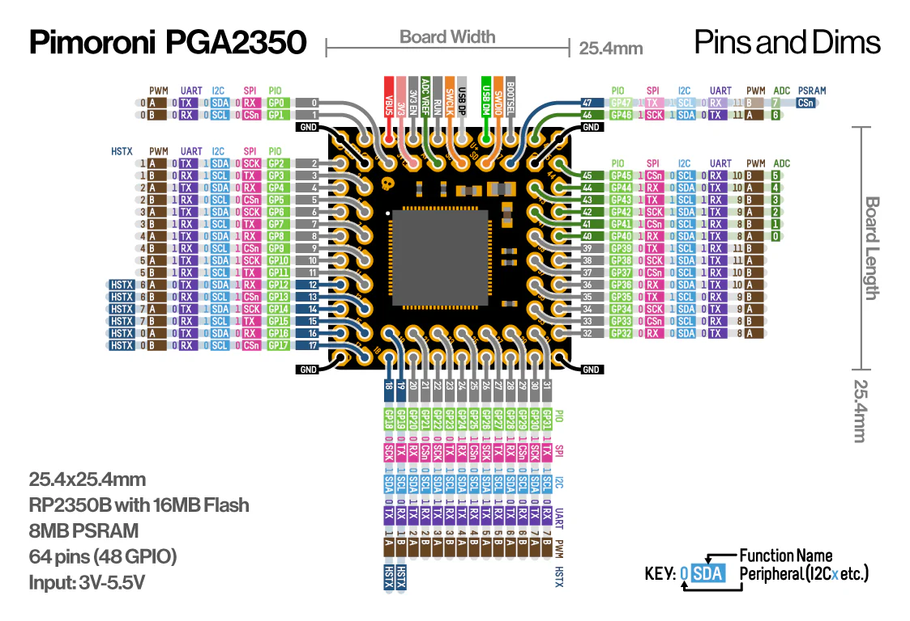

# Pimoroni PGA Boilerplate

This repository is intended to provide a baseline MicroPython build for PGA2040
and PGA2350, in addition to being a minimal example of how you might set up your
own custom MicroPython flavour to support your PGA-based project.

Use this repository as a boilerplate to set up your own project, and GitHub actions
should automatically handle building MicroPython for you.

## Contents

* pga2040 - MicroPython and Pico SDK board definitions for PGA2040
* pga2350 - MicroPython and Pico SDK board definitions for PGA2350, with PSRAM variant
* modules/c/example - An example MicroPython C++ module, demonstrating C class bindings
* modules/py_frozen - Python files intended to be frozen into the firmware
* modules/py_littlefs - Python files intended to be visible/editable in the LittleFS user filesystem
* modules/default.py - The MicroPython manifest file, for specifying frozen libs
* modules/default.txt - The dir2uf2 LittleFS manifest file, for specifying included files
* modules/default.cmake - The MicroPython USER_C_MODULES file, for specifying included C/C++ modules

## PGA2350

More info at [pimoroni.com/pga2350](pimoroni.com/pga2350)

* Powered by RP2350B (Dual Arm Cortex M33 running at up to 150MHz with 520KB of SRAM)
* 16MB of QSPI flash supporting XiP
* 8MB PSRAM (CS wired to GP47 via cuttable trace)
* Crystal oscillator
* On-board 3V3 regulator (max regulator current output 300mA)
* 64 pins, arranged with 2.54mm (0.1") spacing in a Pin Grid Array
* 48 multi-function General Purpose IO (8 can be used for ADC)
* 6 GND pins
* Input voltage range 3V - 5.5V (on VB pin only)
* Measurements: approx 25.4mm x 25.4mm x 3.6mm (L x W x H)
* Programmable with C/C++ or MicroPython

## PGA2040

More info at [pimoroni.com/pga2350](pimoroni.com/pga2040)

* Powered by RP2040
* Dual ARM Cortex M0+ running at up to 133Mhz
* 264kB of SRAM
* 8MB of QSPI flash supporting XiP
* Crystal oscillator
* On-board 3V3 regulator (max regulator current output 300mA)
* 48 pins, arranged with 2.54mm (0.1") spacing in a Pin Grid Array
* 30 multi-function General Purpose IO (4 can be used for ADC)
* 8 GND pins
* Input voltage range 3V - 5.5V (on VB pin only)
* Measurements: approx 21mm x 21mm x 3mm (L x W x H)

